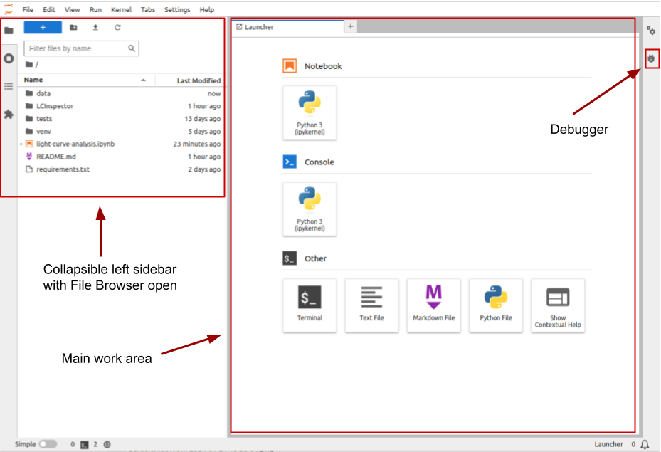
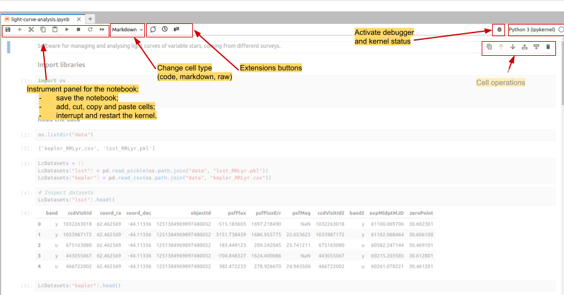
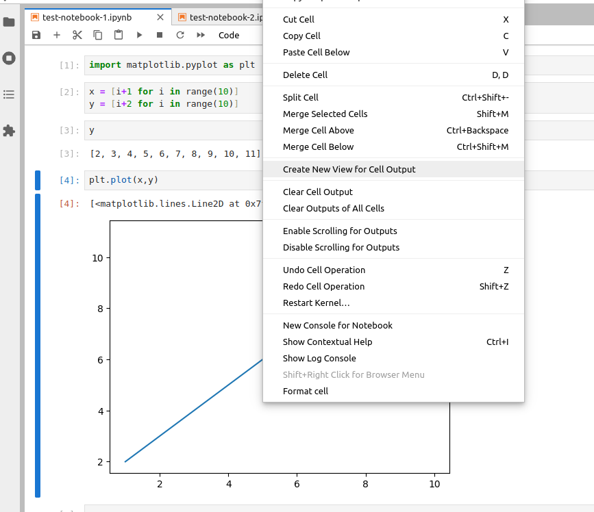
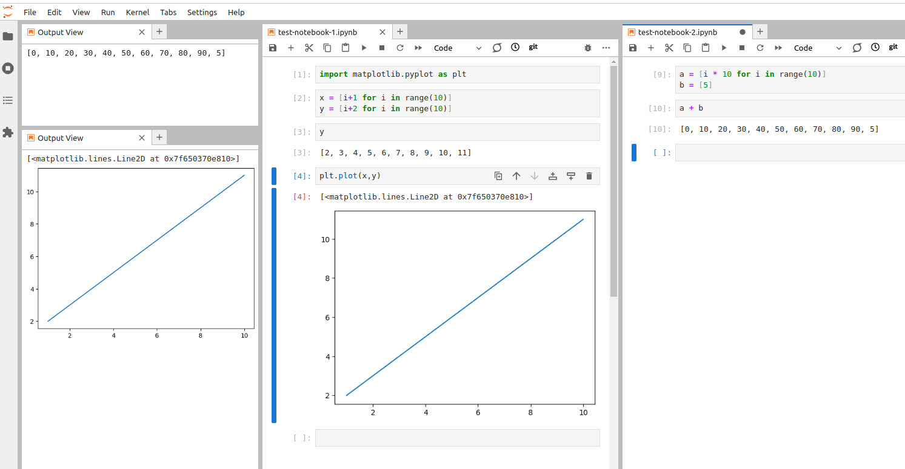
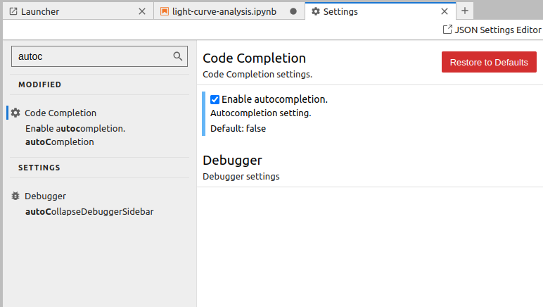

## Introduction
As we have seen in the previous episode -
even a simple software project is typically split into smaller functional units and modules,
which are kept in separate files and subdirectories.
As your code starts to grow and becomes more complex,
it will involve many different files and various external libraries.
You will need an application to help you manage all the complexities of,
and provide you with some useful (visual) facilities for,
the software development process.
Such clever and useful graphical software development applications are called
Integrated Development Environments (IDEs).

## Integrated Development Environments
An IDE normally consists of at least a source code editor,
build automation tools
and a debugger.
The boundaries between modern IDEs and other aspects of the broader software development process
are often blurred.
Nowadays IDEs also offer version control support,
tools to construct graphical user interfaces (GUI)
and web browser integration for web app development,
source code inspection for dependencies and many other useful functionalities.
The following is a list of the most commonly seen IDE features:

- syntax highlighting -
  to show the language constructs, keywords and the syntax errors
  with visually distinct colours and font effects
- code completion -
  to speed up programming by offering a set of possible (syntactically correct) code options
- code search -
  finding package, class, function and variable declarations, their usages and referencing
- version control support -
  to interact with source code repositories
- debugging -
  for setting breakpoints in the code editor,
  step-by-step execution of code and inspection of variables

IDEs are extremely useful and modern software development would be very hard without them.
There are a number of IDEs available for Python development;
a good overview is available from the
[Python Project Wiki](https://wiki.python.org/moin/IntegratedDevelopmentEnvironments).
In addition to IDEs, there are also a number of code editors that have Python support.
Code editors can be as simple as a text editor
with syntax highlighting and code formatting capabilities
(e.g., GNU EMACS, Vi/Vim).
Most good code editors can also execute code and control a debugger,
and some can also interact with a version control system.
Compared to an IDE, a good dedicated code editor is usually smaller and quicker,
but often less feature-rich.
You will have to decide which one is the best for you -
in this course, we will use [Jupyter Lab](https://jupyter.org/install) - a free open-source web-based IDE 
familiar to most Python-coding astronomers.

> ## Is Jupyter Lab an IDE?
> For a long time, **Jupyter Notebook** was not considered as a full-fledged IDE. The main argument against
> considering Jupyter Notebooks an IDE was that it lacked a lot of functionality
> that is essential for the full cycle of software development. The most notable instrument that wasn't present in
> Jupyter Notebook was the debugger.
>
> However, modern versions of **Jupyter Lab**, an evolutionary development of Jupyter Notebook, come with the built-in debugger, as well as
> with all the rest of the basic IDE instruments. Formally, this makes Jupyter Lab a 'real' IDE. At the same time,
> Jupyter Lab and classic IDEs (such as PyCharm or Spyder) impose distinctly different coding routines.
> Jupyter Lab (as Jupyter Notebook before) assumes an interactive cell-by-cell development and execution of the code,
> which is well-suited for data exploration and analysis and for small-scale software development. At the same time, for larger projects
> that do not require executing small parts of the code separately, 'classic' IDEs are more suitable. 
>
{: .callout}

## Using Jupyter Lab

Let's open our project in Jupyter Lab now and familiarise ourselves with some commonly used features.

### Jupyter Lab interface
To launch Jupyter Lab, activate the `venv` environment created in the previous episode and type in the terminal:
 ~~~
 (venv) $ jupyter lab
 ~~~
 {: .language-bash}
The output will look similar to this:
 ~~~
 To access the server, open this file in a browser:
        file:///home/alex/.local/share/jupyter/runtime/jpserver-2946113-open.html
    Or copy and paste one of these URLs:
        http://localhost:8888/lab?token=e2aff7125e9917868a16b8b627f73995eb83effbcafeee05
        http://127.0.0.1:8888/lab?token=e2aff7125e9917868a16b8b627f73995eb83effbcafeee05
 ~~~
 {: .output}
Now you can click on one of the URLs below and Jupyter Lab will open in your browser.

{: .image-with-shadow width="800px" }

Jupyter Lab starting interface

The [Jupyter Lab interface](https://jupyterlab.readthedocs.io/en/stable/user/interface.html#) includes the following areas:
1. Menu bar, from which you can access most common Jupyter Lab functions;
2. A collapsible left sidebar, in which four tabs are present:
   - File Manager. From here you can manage the files and directories in your repository folder.
   - Running terminal and kernels. Here you can find the list of running Jupyter Notebook kernels and console sessions.
   - Table of contents. Here Jupyter Lab will automatically generate a table of contents of your notebooks (using headers and other
     markdown cells) and Python files (using function and class definitions).
   - Extension Manager. In this section, it is possible to install extensions that expand Jupyter Lab functionality, for example,
     allowing integration with Git, adding CSS formatting, and so on.
3. The main work area. When you just opened Jupyter Lab, you can see several options for starting your work, such as
   creating a new Notebook, opening a new Python console session, or creating a new text or Python file. The list of these options
   will vary depending on which kernels and programming languages you have installed. When you open a Notebook or a file, it will appear in a separate tab in this area.
4. In the right collapsible sidebar you can access the notebooks' Properties Manager and Debugger, which can be used for inspecting the variables and managing Breakpoints.

### Opening a Software Project
In the left sidebar, open the `File Browser` and look through the files present here. You can inspect the `requirements.txt` file, where we saved the list 
of packages installed in our virtual environment, and `README.md`, containing some basic information about the project. Later we will add more information to
this file. For now, double click on the `light-curve-analysis.ipynb`. 

In the opened tab we can see a number of **cells**. Some of them contain Python code, while others display formatted text ('Markdown'). 
You can change the type of the cell in the drop-down menu in the instrumental panel on the top of the tab. You can execute cells
one by one by pressing `Shift+Enter`, or run them all by choosing `Run > Run All` in the main menu or by pressing a corresponding
button in the tab instrumental panel. Code cells produce **outputs**, which may contain text, tables and static or interactive plots.

{: .image-with-shadow width=800px" }

Interface elements of a notebook tab

By default the notebooks are opened in tabs that take the full screen, however, you can align them vertially
or horizontally by dragging them in the preferred place. You can also place an output of any cell into a separate tab. 
For this, make a right-click on 
the output content and choose `Create New View for Cell Output`. You can open multiple tabs for the cell outputs and 
reorder them in the same way as the notebook tabs.

{: .image-with-shadow width=800px" }

Creating cell output view

{: .image-with-shadow width=800px" }

You can order the notebook tabs and cell output views any way you like

The code in the notebook is displayed using different colours, following the rules set up for
the **syntax highlighting**. 
Syntax highlighting is a feature that displays source code terms
in different colours and fonts according to the syntax category the highlighted term belongs to.
It also makes syntax errors visually distinct.
Highlighting does not affect the meaning of the code itself -
it's intended only for humans to make reading code and finding errors easier. The code highlighting
color scheme depends on the programming language (or, to be more precise,
on the kernel which is currently connected to your Notebook), and in the Text Editor, you can pick the language yourself
in `View > Text Editor Syntax Highlighting` menu.
By default it is inferred from the file extension, e.g. Python for `.py` files. 

### Code Completion & Documentation References

{: .image-with-shadow width="600px" }

Context-aware code completion suggestions (`Tab`)

{: .image-with-shadow width="600px" }

Contextual help in a pop-up window (`Shift+Tab`)

{: .image-with-shadow width="600px" }

Setting up auto-completion

When you are typing code, you can use completion suggestions and contextual help tools, included in Jupyter Lab.
You can use three hotkey combinations for using these tools:
1. When you start typing a command, you can press `Tab`, and Jupyter Lab will offer you options of code
   that can follow.
2. You also can type `Shift+Tab` to open contextual help in a pop-up window.
3. Another option is to use `Ctrl+I` for opening contextual help in the right sidebar.
4. Finally, you can enable code auto-completion. For this, go to 'Settings > Settings Editor' and start typing
   'auto-completion' in the Search box. Then select the 'Enable autocompletion' checkbox.

Using context-aware code completion features speeds up the process of coding,
and reduces typos and other common mistakes. Using contextual help also improves
the quality of the code, as well as simplifies the process for the programmer. 

> ## How does contextual help work?
> Contextual help relies on the docstrings, written in the library's source files by the developers.
> If you look at code definitions of well-maintained libraries, such as Pandas or Numpy,
> you will see that the docstrings are very detailed: they contain input parameters, outputs,
> algorithm descriptions, and even examples of usage. Later we will talk about how to write good docstrings,
> but here you can see *why* they are so essential.
{: .callout}

> ## Try completion, auto-completion, and contextual help functions
> Execute already existing cells of the notebook. There are several ways to do this:
> 1. You can go through the cells, clicking `Shift+Enter` on each of them.
> 2. You can use `Run > Run all cells` menu.
> 4. You can use `Restart the kernel and run all cells` button on the tool panel on the top of
>    your notebook tab. Be aware that when you restart the kernel, you lose all the data from
>    already executed code, e.g. all the variables will be deleted.
>    
> After that, inspect contextual help of several functions, e.g. `pd.read_pickle`, `np.array`, and `os.path.join`.
> Pay attention to which information is included in the contextual help and in which format.
> Next, get the list of the columns in one of the opened datasets, using completion at every step.
> 
> > ## Solution
> > To get the list of the columns you can use the following code: `LcDatasets['kepler'].columns`.
> > By pressing `Tab` once you started typing 'LcDatasets', 'kepler' and 'columns', you will get suggestions
> > for the available options of the following code.
> {: .solution}
> After that, enable auto-completion and get the list of the columns of the second dataset.
> Depending on what is more convenient for you, you can leave auto-completion function turned on, or turn it off.
{: .challenge}

### Code Search
Jupyter Lab offers you the possibility to search and replace text within the file, using case matching and regular expressions.
You can perform the search within the whole document or only in a single cell, with or without cell outputs (the results of execution 
of the code within the cell). To access the search tool, use `Ctrl+F` key combination, or `Edit > Find` in the main menu.

> ## Searching across multiple notebooks
> Jupyter Lab built-in search does not allow searching strings across multiple files.
> However, such functionality is available with [jupyterlab-search-replace](https://github.com/jupyterlab-contrib/search-replace)
> extension. 
{: .callout}

### Jupyter Lab magic
Jupyter magic commands or simply magics are special commands, provided by the default Jupyter kernel ('backend' that 
executes the code) called IPython. Magics allow us to conveniently perform many useful operations since they can interact
with operational system and Jupyter kernels.
There are two types of magics: the ones that operate on a single line of the following code (the code has to be written on the same line 
after a single space, without parenthesis or quotation marks), and the ones that act upon 
the content of a whole single cell. The line magics are preceded by a single percentage symbol (`%`), while cell magics 
use two percentage symbols (`%%`). Here is a short list of the most useful magics:
- `%magic`: prints information about magics system
- `%lsmagic`: lists all magic commands in a convenient form
- `%quickref`: another helper function that shows references for the magic commands
- `%time`, `%timeit` and `%%timeit`: measure the execution time of the code. 
- `%cd`, `%ls`, `%pwd` and other console commands: executes terminal commands
- `%run`: executes another '.ipynb' or '.py' file from within the current notebook
- `%who`: lists the defined variables. It is possible to list only variables of a certain type, e.g. `%who string`

> ## `%time`, `%timeit` and `%%timeit`
> The difference between `%time` and `%timeit` is
> that first command executes your code only once, while the second runs it
> several times and measures the average execution time, attempting to get a more precise
> value.
> However, the second command isn't always better! For example,
> if you measure the execution time of a list sorting, after the first
> execution the list will already be sorted, and executing the same code over already sorted list
> will take much less time, meaning that the average execution time will be skewed towards
> lesser numbers.
> `%%timeit`, as follows from two '%' signs, measures the execution time for all code in a cell together. 
{: .callout}

> ## Try out different magics
> Try several different magic commands, such as `%lsmagic`, `%pwd` and `%who`.
> Use `%who` command to get the list of `dict` variables (pay attention, that if you use `%who` command
> without specifying the type of the variable, it will also include the packages that you imported in the notebook).
{: .challenge}

Apart from the built-in magics, there are many more that you can install additionally. It is also possible to
develop your own magic commands.

> ## Installing packages from Jupyter notebook interface or Jupyter console session
> Since magics allow us to execute terminal commands, there is a way to install Python packages right
> from the Jupyter interface. We can run `%pip3 install astropy` right in a Jupyter cell.
> This is a standard way of installing packages in cloud Jupyter Notebook services, such as Google Colab or
> the Notebook aspect of Rubin Science Platform.
> Pay attention, though, that another common way of doing this, using `!` instead of `%` before the installation command,
> is in general not safe and can lead to the dependencies issues due to the particularities of how OS and Jupyter kernels interact.
> You can still see it often, since magic command for `pip` appeared only in the later versions of IPython.
{: .callout}


