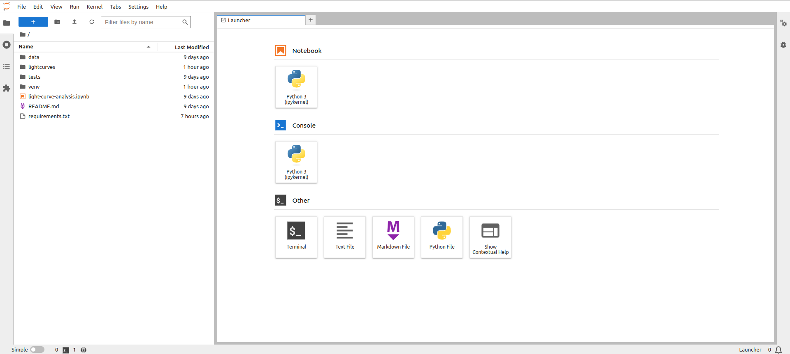

## Introduction
As we have seen in the previous episode -
even a simple software project is typically split into smaller functional units and modules,
which are kept in separate files and subdirectories.
As your code starts to grow and becomes more complex,
it will involve many different files and various external libraries.
You will need an application to help you manage all the complexities of,
and provide you with some useful (visual) facilities for,
the software development process.
Such clever and useful graphical software development applications are called
Integrated Development Environments (IDEs).

## Integrated Development Environments
An IDE normally consists of at least a source code editor,
build automation tools
and a debugger.
The boundaries between modern IDEs and other aspects of the broader software development process
are often blurred.
Nowadays IDEs also offer version control support,
tools to construct graphical user interfaces (GUI)
and web browser integration for web app development,
source code inspection for dependencies and many other useful functionalities.
The following is a list of the most commonly seen IDE features:

- syntax highlighting -
  to show the language constructs, keywords and the syntax errors
  with visually distinct colours and font effects
- code completion -
  to speed up programming by offering a set of possible (syntactically correct) code options
- code search -
  finding package, class, function and variable declarations, their usages and referencing
- version control support -
  to interact with source code repositories
- debugging -
  for setting breakpoints in the code editor,
  step-by-step execution of code and inspection of variables

IDEs are extremely useful and modern software development would be very hard without them.
There are a number of IDEs available for Python development;
a good overview is available from the
[Python Project Wiki](https://wiki.python.org/moin/IntegratedDevelopmentEnvironments).
In addition to IDEs, there are also a number of code editors that have Python support.
Code editors can be as simple as a text editor
with syntax highlighting and code formatting capabilities
(e.g., GNU EMACS, Vi/Vim).
Most good code editors can also execute code and control a debugger,
and some can also interact with a version control system.
Compared to an IDE, a good dedicated code editor is usually smaller and quicker,
but often less feature-rich.
You will have to decide which one is the best for you -
in this course, we will use [Jupyter Lab](https://jupyter.org/install) - a free open-source web-based IDE 
familiar to most Python-coding astronomers.

> ## Is Jupyter Lab an IDE?
> In the astronomical community, Jupyter **Notebooks** is not an IDE, since they lack a lot of functionality
> that is essential for the full cycle of software development. The most notable instrument that wasn't present in
> Jupyter Notebooks was the debugger.
>
> However, modern versions of Jupyter **Lab**, an evolutionary development of Jupyter Notebooks, come with the built-in debugger, as well as
> with all the rest of the basic IDE instruments. Formally, this makes Jupyter Lab a full-fledged IDE. At the same time,
> Jupyter Lab and classic IDEs (such as PyCharm or Spyder) impose distinctly different coding routines.
> Jupyter Lab (as Jupyter Notebooks before them) assumes an interactive cell-by-cell development and execution of the code,
> which is well-suited for data exploration and analysis, as well as for small-scale software development. For larger projects
> that do not require executing small parts of the code separately, 'classic' IDEs are more suitable. 
>
{: .callout}

## Using Jupyter Lab

Let's open our project in Jupyter Lab now and familiarise ourselves with some commonly used features.

### Jupyter Lab interface
To launch Jupyter Lab, activate the `venv` environment created in the previous episode and type in the terminal:
 ~~~
 (venv) $ jupyter lab
 ~~~
 {: .language-bash}
The output will look similar to this:
 ~~~
 To access the server, open this file in a browser:
        file:///home/alex/.local/share/jupyter/runtime/jpserver-2946113-open.html
    Or copy and paste one of these URLs:
        http://localhost:8888/lab?token=e2aff7125e9917868a16b8b627f73995eb83effbcafeee05
        http://127.0.0.1:8888/lab?token=e2aff7125e9917868a16b8b627f73995eb83effbcafeee05
 ~~~
 {: .output}
Now you can click on one of the URLs below and Jupyter Lab will open in your browser.

{: .image-with-shadow width="800px" }

The Jupyter Lab interface includes the following areas:
1) Menu bar, from which you can access most common Jupyter Lab functions;
2) A collapsible left sidebar, in which four tabs are present:
   - File Manager. From here you can manage the files and directories in your repository folder.
   - Running terminal and kernels. Here you can find the list of running Jupyter Notebook kernels and console sessions.
   - Table of contents. Here Jupyter Lab will automatically generate a table of content of your notebooks and Python files, 
   - Extension Manager.

### Opening a Software Project

### Syntax Highlighting
The first thing you may notice is that code is displayed using different colours.
Syntax highlighting is a feature that displays source code terms
in different colours and fonts according to the syntax category the highlighted term belongs to.
It also makes syntax errors visually distinct.
Highlighting does not affect the meaning of the code itself -
it's intended only for humans to make reading code and finding errors easier.

{: .image-with-shadow width="800px" }

### Code Completion
As you start typing code,
PyCharm will offer to complete some of the code for you in the form of an auto completion popup.
This is a context-aware code completion feature
that speeds up the process of coding
(e.g. reducing typos and other common mistakes)
by offering available variable names,
functions from available packages,
parameters of functions,
hints related to syntax errors,
etc.

{: .image-with-shadow width="600px" }

### Code Definition & Documentation References
Jupyter Lab tools: Tab, Shift+Tab, Ctrl+I
{: .image-with-shadow width="800px" }

### Code Search
You can search for a text string within a project,
use different scopes to narrow your search process,
use regular expressions for complex searches,
include/exclude certain files from your search, find usages and occurrences.
To find a search string in the whole project:

### Version Control
Version control in Jupyter Lab: Git extension. **Maybe it's worth moving this part to another day, so that 
people didn't have to install extensions mid-episode (it may take time and cause problems...)**

### Running Scripts in Jupyter Lab


