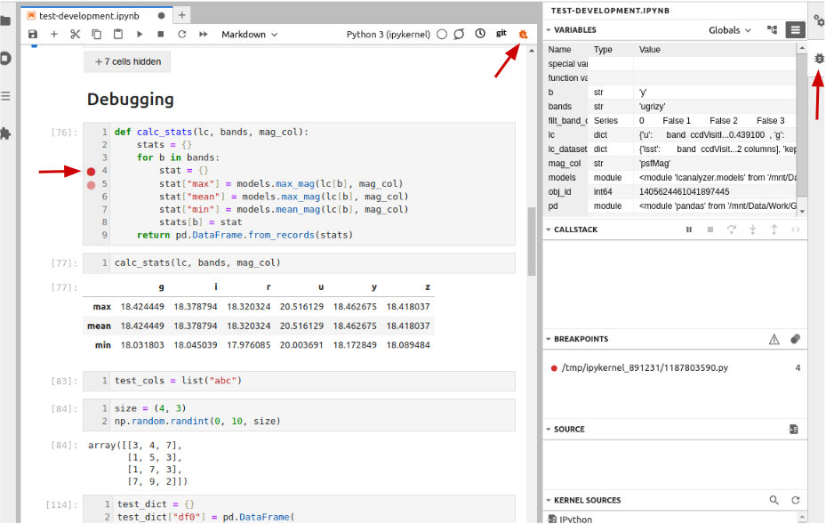
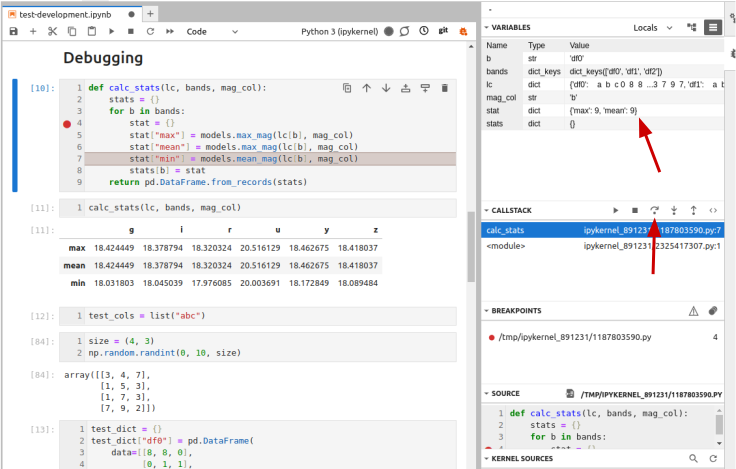

## Introduction

Unit testing can tell us something is wrong in our code
and give a rough idea of where the error is
by which test(s) are failing.
But it does not tell us exactly where the problem is (i.e. what line of code),
or how it came about.
The process of finding out what causes errors in our code is called **debugging**.
There are numerous toold and methods for doing this, and in all likelyhood,
you are already using some of them. Perhaps the most common way of debugging your 
Python code, especially when the project is relatively simple, is to use `print`
statements for inspecting intermediate values of the variables. Jupyter Lab with its
cell-by-cell workflow especially encourages this kind of debugging. Another approach
is to split a larger piece of code into smaller chunks and check them piece by piece.
However, there is more advanced tool for this, called **debugger**.

## Setting the Scene

Let us add a new function called `calc_stats()` 
that will calculate for us all three statistical indicators (min, max and mean) for all
bands of our light curve.
(Make sure you create a new feature branch for this work off your `develop` branch.)

~~~
def calc_stats(lc, bands, mag_col):
    # Calculate max, mean and min values for all bands of a light curve
    stats = {}
    for b in bands:
        stat = {}
        stat["max"] = models.max_mag(lc[b], mag_col)
        stat["mean"] = models.max_mag(lc[b], mag_col)
        stat["min"] = models.mean_mag(lc[b], mag_col)
        stats[b] = stat
    return pd.DataFrame.from_records(stats)
~~~
{: .language-python}

**Note:** *there are intentional mistakes in the above code,
which will be detected by further testing and code style checking below
so bear with us for the moment!*

This code accepts a dictionary of DataFrames that contain observations of a single object in all bands.
Then this code iterates through the bands, calculating the requested statistical values and storing them
in a dictionary. At the end, these dictionaries are converted into a DataFrame, where column names are the
keys of the original `lc` dictionary, and the index ('row names') are the names of the statistics ('max',
'mean' and 'min'). Pass one of our previously designed light curves to this function
to see that the result is an accurate and informative pandas table.

> ## Can't we save them directly into a DataFrame?
> Technically, we can. However, editing DataFrames row by row or element by element
> is inefficient from the computational point of view. For this reason, when creating a frame
> row by row is inevitable, storing data
> in a list, dictionary or array and then converting them in a DataFrame is the preferred
> solution. It is also worth noting that in many cases iterations in a loop
> through the rows of some kind of a table can be avoided entirely with a better
> design of the algorithm.
{: .callout}

Now let's design a test case for this function:

~~~
test_cols = list("abc")
test_dict = {}
test_dict["df0"] = pd.DataFrame(
    data=[[8, 8, 0], 
          [0, 1, 1], 
          [2, 3, 1], 
          [7, 9, 7]], columns=test_cols
)
test_dict["df1"] = pd.DataFrame(
    data=[[3, 8, 2], 
          [3, 8, 0], 
          [3, 9, 8], 
          [8, 2, 5]], columns=test_cols
)
test_dict["df2"] = pd.DataFrame(
    data=[[8, 4, 3], 
          [7, 6, 3], 
          [4, 2, 9], 
          [6, 4, 0]], columns=test_cols
)
~~~
{: .language-python}

Remember, that we don't have to fill the data manually, but can use built-in `numpy`
random generator. For example, for the data above `size = (4,3); np.random.randint(0, 10, size)` 
was used.

The expected output for these data will look like this:

~~~
test_output = pd.DataFrame(data=[[9,9,6],[5.25,6.75,4.],[1,2,2]],columns=['df0','df1','df2'],index=['max','mean','min'])
~~~
{: .language-python}

Finally, we can use `assert` statement to check if our function produces what we expect...
~~~
assert calc_stats(test_dict, test_dict.keys(), 'b') == test_output
~~~
{: .language-python}

...and get a `ValueError`:
~~~
...
ValueError: The truth value of a DataFrame is ambiguous. Use a.empty, a.bool(), a.item(), a.any() or a.all().
~~~
{: .output}

The reason for this is that `assert` takes a condition that produces a _single_ boolean value,
but using `==` for two DataFrames results in an element-wise comparison and produces a _DataFrame_
filled with booleans. 

This is the case when we need to use a more powerful `assert` function, the one that is developed specifically 
for a certain variable type. `Pandas` has its own module called `testing` that contains a number of type-specific
`assert` functions. Let's import this module:

~~~
import pandas.testing as pdt
~~~
{: .language-python}

And use `assert_frame_equal` function that can compare DataFrames in a meaningful way:
~~~
pdt.assert_frame_equal(calc_stats(test_dict, test_dict.keys(), 'b'),
                              test_output,
                             check_exact=False,
                             atol=0.01)
~~~
{: .language-python}

The first two arguments of this function are just what we would expect: the call of our `calc_stats`
function and the expected `test_output`. `assert_frame_equal` will be comparing these two DataFrames.
The next two arguments allow this function to compare the DataFrames with only some degree of precision.
This precision is determined by the argument `atol`, which stands for 'absolute tolerance'. The DataFrames
will be considered equal if their elements differ no more than by `atol` value. This is similar to the 
`pytest.approx` that we encountered in the previous episodes. 

This assertion is falining with an error message that does not give many clues as to what went wrong.

~~~
...
AssertionError: DataFrame.iloc[:, 0] (column name="df0") are different

DataFrame.iloc[:, 0] (column name="df0") values are different (66.66667 %)
[index]: [max, mean, min]
[left]:  [9.0, 9.0, 5.25]
[right]: [9.0, 5.25, 1.0]
At positional index 1, first diff: 9.0 != 5.25
~~~
{: .output}

Apparently, there are differences between the two DataFrames in the column 'df0';
the values in the 'max' row are the same, but the 'mean' and 'min' values are different.
Instead of adding `print` statements in our function and executing it again and again, let's
use a debugger at this point to see what is going on and why the function failed.

## Debugging in Jupyter Lab
The debugger in essence is a software for inspecting the changes that happen to
the variables, memory allocation and other resources when your code is being executed. 
This software can be a simple package that will print something useful in the console 
(in fact, Python has such a package which is called [`pdb`](https://docs.python.org/3/library/pdb.html))
or a GUI tool, which is usually integrated into the IDE. To enable the debugger in Jupyter Lab,
click on a small bug pictogram in the top right corner of your notebook tab (it will turn orange,
indicating that debugging mode is active), and then open the debugger right-side panel
(also marked with a bug pictogram).

The debugger panel contains five sections:
- Varaibles. This is the place where all variables, user-defined or not, can be inspected in
  all the details. You can switch between the tree view and table view using the buttons in the top right
  corner of this section. The tree view provides you with more information, for example, you can see the full
  list of methods available for this object. However, table view is more concise and simple for understanding,
  as it contains only variable names, types and values.
- Callstack. Here you can trace the chain of function calls that brings you to the **breakpoint** -
  a stopping place in the code, that you define manually. 
- Breakpoints. Here you will find the list of your breakpoints.
- Sources. The currently debugged code will be shown here.
- Kernel sources. Through this section you can inspect the source code
  of all modules that are currently available to the kernel.

{: .image-with-shadow width="800px" }

Turning on the debugger and setting the breakpoint. The 'Variables' section
in the table view shows all previously defined variables.

To inspect how our variables change during code execution and find the source of the error,
we should set a breakpoint somewhere before the error occurs. To be on the safe side, let's put the 
breakpoint on the line where we define our `stat` dictionary. Now we should go to the cell where we execute
our assertion of the function output and the expected output and run it.

The execution of the code will start, but then pause once the interpreter reaches the breakpoint.
Here we should start paying attention to the 'Variables' section. At this point, we have only the variables
that we passed to the function as the arguments, and an empty `stats` dictionary. In the 'Callstack'
section, let's click on the `Next` button (the third one in the row; alternatively you can press `F10`).
The interpreter will move to the next line, and we will see a new variable in the 'Variables' - an empty dict
called `stat`.

Keep clicking `Next` and moving through the code. You'll notice that some elements appear in the `stat` dictionary:
first `max` with value 9, then `mean` with value 9...

{: .image-with-shadow width="800px" }

Finding the error

Wait a second. `mean` equals 9? That can't be right.

Here we found the line in which an error occurs. After looking at it closely we will notice that we used the wrong function,
and if we keep going through the code with the debugger, we'll notice that the next line contains an error as well.

Case solved! Now we can `Terminate` the debugging (by clicking on a 'Stop' button in the 'Callstack' section), turn off the debugger
(by clicking on the orange bug sign in the notebook tab; do not skip this step as debugging mode affects performance) and fix the errors.

> ## Is this really easier than `print` statements?
> When using the debugger for the first time, it may appear that it is more
> complicated and cumbersome than just inserting in the code `print` statements
> here and there. For a short and simple script it is often correct.
> However, debugging a complex function with multiple calls of other functions
> can be done faster and with higher efficiency with the debugger. Imaging
> having to print a large DataFrame variable every two or three lines - it is much easier
> to inspect how this variable changes 'in real time'.
>  
{: .callout}

> ## Optional Exercise: Extracting the Functions into `.py` Files
>
> Following the best practices that you learned on Day 1,
> put the `calc_stats` function into the `models.py` file
> and convert the assertion for this function into a proper test
> in the `tests/test_models.py`.
>
{: .challenge}

## Corner or Edge Cases

The test cases that we have written so far 
are parameterised with a fairly standard DataFrames filled with random integers or floats.
However, when writing your test cases,
it is important to consider parameterising them by unusual or extreme values,
in order to test all the edge or corner cases that your code could be exposed to in practice.
Generally speaking, it is at these extreme cases that you will find your code failing,
so it's beneficial to test them beforehand.

What is considered an "edge case" for a given component depends on
what that component is meant to do. 
For numerical values, extreme cases could be zeros,
very large or small values,
not-a-number (`NaN`) or infinity values.
Since we are specifically considering *arrays* of values,
an edge case could be that all the numbers of the array are equal.

For all the given edge cases you might come up with,
you should also consider their likelihood of occurrence.
It is often too much effort to exhaustively test a given function against every possible input,
so you should prioritise edge cases that are likely to occur. 
Let's consider a new function, which purpose is to normalize a single light curve:

~~~
def normalize_lc(df,mag_col):
    # Normalize a single light curve
    min = min_mag(df,mag_col)
    max = max_mag((df-min),mag_col)
    lc = (df[mag_col]-min)/max
    return lc
~~~
{: .language-python}

For a function like this, a common edge case might be the occurrence of zeros,
and the case where all the values of the array are the same. Indeed, if we passed 
to such a function a 'light curve' where all measurements are zeros, we would expect
to have zeros in return. However, since we have division in this function, it will return
and array of 'NaN' instead of this.

With this in mind,
let us create a test `test_normalize_lc` with parametrization
corresponding to an input array of random integers, an input array of all 0,
and an input array of all 1.

~~~
# Parametrization for normalize_lc function testing
@pytest.mark.parametrize(
    "test_input_df, test_input_colname, expected",
    [
        (pd.DataFrame(data=[[8, 9, 1], 
                            [1, 4, 1], 
                            [1, 2, 4], 
                            [1, 4, 1]], 
                      columns=list("abc")),
        "b",
        pd.Series(data=[1,0.285,0,0.285])),
        (pd.DataFrame(data=[[1, 1, 1], 
                            [1, 1, 1], 
                            [1, 1, 1], 
                            [1, 1, 1]], 
                      columns=list("abc")),
        "b",
        pd.Series(data=[0.,0.,0.,0.])),
        (pd.DataFrame(data=[[0, 0, 0], 
                            [0, 0, 0], 
                            [0, 0, 0], 
                            [0, 0, 0]], 
                      columns=list("abc")),
        "b",
         pd.Series(data=[0.,0.,0.,0.])),
    ])
def test_normalize_lc(test_input_df, test_input_colname, expected):
    """Test how normalize_lc function works for arrays of positive integers."""
    from lcanalyzer.models import normalize_lc
    import pandas.testing as pdt
    pdt.assert_series_equal(normalize_lc(test_input_df,test_input_colname),expected,check_exact=False,atol=0.01,check_names=False)
~~~
{: .language-python}

Pay attention, that since this our `normalize_lc` function returns a `pandas.Series`, we have to use the corresponding assert function
(`pdt.assert_series_equal`). Another thing to pay attention to is the arguments of this function. Not only we specify the `atol` for 
ensuring that there will be no issues when comparing floats, but also set `check_names=False`, since by default the `Series` returned from
the `normalize_lc` function will have the name of the column for which we performed the normalization. Custom assert functions, such as
`assert_series_equal`, often take a large number of arguments that specify which parameters of the objects have to be compared. E.g. you can 
opt out of comparing the `dtypes` of a `Series`, the column orders of a `DataFrame` and so on.

Running the tests now from the command line results in the following assertion error,
due to the division by zero as we predicted. Note that not only the test case with all zeros
fails, but also the test with all ones too, due to the extraction of the `min` value!

~~~
E   AssertionError: Series are different
E   
E   Series values are different (100.0 %)
E   [index]: [0, 1, 2, 3]
E   [left]:  [nan, nan, nan, nan]
E   [right]: [0.0, 0.0, 0.0, 0.0]
E   At positional index 0, first diff: nan != 0.0

testing.pyx:173: AssertionError
====================================================================================== short test summary info ======================================================================================
FAILED tests/test_models_full.py::test_normalize_lc[test_input_df1-b-expected1] - AssertionError: Series are different
FAILED tests/test_models_full.py::test_normalize_lc[test_input_df2-b-expected2] - AssertionError: Series are different
~~~
{: .output}

How can we fix this? For example, we can replace all the NaNs in the
return Series with zeros using `pandas` function `fillna`. 
~~~
...
def normalize_lc(df,mag_col):
    # Normalize a single light curve
    min = min_mag(df,mag_col)
    max = max_mag((df-min),mag_col)
    lc = (df[mag_col]-min)/max
    lc = lc.fillna(0)
    return lc
...
~~~
{: .language-python}

## Defensive Programming

In the previous section, we made a few design choices for our `normalize_lc` function:

1. We are implicitly converting any `NaN` to 0,
2. Normalising a constant array of magnitudes in an identical array of 0s,
3. We don't warn the user of any of these situations.

This could have be handled differently.
We might decide that we do not want to silently make these changes to the data,
but instead to explicitly check that the input data satisfies a given set of assumptions
(e.g. no negative values or no values outside of a certain range)
and raise an error if this is not the case.
Then we can proceed with the normalisation,
confident that our normalisation function will work correctly.

Checking that input to a function is valid via a set of preconditions
is one of the simplest forms of **defensive programming**
which is used as a way of avoiding potential errors.
Preconditions are checked at the beginning of the function
to make sure that all assumptions are satisfied.
These assumptions are often based on the *value* of the arguments, like we have already discussed.
However, in a dynamic language like Python
one of the more common preconditions is to check that the arguments of a function
are of the correct *type*.
Currently there is nothing stopping someone from calling `normalize_lc` with
a string, a dictionary, or another object that is not a DataFrame, or from
passing a DataFrame filled with strings or lists.

As an example, let us change the behaviour of the `normalize_lc()` function
to raise an error if some magnitudes are smaller than '-90' (since in astronomical data '-99.' or '-99.9' are
common filler values for 'NaNs').
Edit our function by adding a precondition check like so:

~~~
...
    if any(df[mag_col].abs() > 90):
        raise ValueError(mag_col+' contains values with abs() larger than 90!')
...
~~~
{: .language-python}

We can then modify our test function
to check that the function raises the correct exception - a `ValueError` -
when input to the test contains '-99.9' values.
The [`ValueError`](https://docs.python.org/3/library/exceptions.html#ValueError) exception
is part of the standard Python library
and is used to indicate that the function received an argument of the right type,
but of an inappropriate value.

In `lcanalyzer/models.py`
~~~
def normalize_lc(df,mag_col):
    # Normalize a light curve
    if any(df[mag_col].abs() > 90):
        raise ValueError(mag_col+' contains values with abs() larger than 90!')
    min = min_mag(df,mag_col)
    max = max_mag((df-min),mag_col)
    lc = (df[mag_col]-min)/max
    lc = lc.fillna(0)
    return lc
~~~
{: .language-python}

Here we added a condition that if our input data contains values that are larger than 90 or smaller than -90,
we should raise a `ValueError` with the corresponding message.

In `tests/test_models.py`
~~~
# Parametrization for normalize_lc function testing with ValueError
@pytest.mark.parametrize(
    "test_input_df, test_input_colname, expected, expected_raises",
    [
        (pd.DataFrame(data=[[8, 9, 1], 
                            [1, 4, 1], 
                            [1, 2, 4], 
                            [1, 4, 1]], 
                      columns=list("abc")),
        "b",
        pd.Series(data=[1,0.285,0,0.285]),
        None),
        (pd.DataFrame(data=[[1, 1, 1], 
                            [1, 1, 1], 
                            [1, 1, 1], 
                            [1, 1, 1]], 
                      columns=list("abc")),
        "b",
        pd.Series(data=[0.,0.,0.,0.]),
        None),
        (pd.DataFrame(data=[[0, 0, 0], 
                            [0, 0, 0], 
                            [0, 0, 0], 
                            [0, 0, 0]], 
                      columns=list("abc")),
        "b",
        pd.Series(data=[0.,0.,0.,0.]),
        None),
        (pd.DataFrame(data=[[8, 9, 1], 
                            [1, -99.9, 1], 
                            [1, 2, 4], 
                            [1, 4, 1]], 
                      columns=list("abc")),
        "b",
        pd.Series(data=[1,0.285,0,0.285]),
        ValueError),
    ])
def test_normalize_lc(test_input_df, test_input_colname, expected,expected_raises):
    """Test how normalize_lc function works for arrays of positive integers."""
    from lcanalyzer.models import normalize_lc
    import pandas.testing as pdt
    if expected_raises is not None:
        with pytest.raises(expected_raises):
            pdt.assert_series_equal(normalize_lc(test_input_df,test_input_colname),expected,check_exact=False,atol=0.01,check_names=False)
    else:
        pdt.assert_series_equal(normalize_lc(test_input_df,test_input_colname),expected,check_exact=False,atol=0.01,check_names=False)
~~~
{: .language-python}

And in the `test_models` we had to add to our parametrization a new function argument 
called `expected_raises`, which is equal to `None`
for the test cases where our function should not invoke any raises. In the testing function itself
we are adding an `if` statement to separately handling the situation when a raise is expected.

Be sure to commit your changes so far and push them to GitHub.

> ## Optional Exercise: Add a Precondition to Check the Correct Type and Column Names
>
> Add preconditions to check that input data is `DataFrame` object and that its columns
> contain the column for which we have to perform normalization.
> Add corresponding tests to check that the function raises the correct exception.
> You will find the Python function
> [`isinstance`](https://docs.python.org/3/library/functions.html#isinstance)
> useful here, as well as the Python exception
> [`TypeError`](https://docs.python.org/3/library/exceptions.html#TypeError).
> Once you are done, commit your new files,
> and push the new commits to your remote repository on GitHub.
>
{: .challenge}

If you do the challenge, again, be sure to commit your changes and push them to GitHub.

You should not take it too far by trying to code preconditions for every conceivable eventuality.
You should aim to strike a balance between
making sure you secure your function against incorrect use,
and writing an overly complicated and expensive function
that handles cases that are likely never going to occur.
For example, it would be sensible to validate the values of your
light curve measurements
when it is actually read from the file,
and therefore there is no reason to test this again in `normalize_lc` or 
any of our functions related to statistics.
You can also decide against adding explicit preconditions in your code,
and instead state the assumptions and limitations of your code
for users of your code in the docstring
and rely on them to invoke your code correctly.
This approach is useful when explicitly checking the precondition is too costly.

## Improving Robustness with Automated Code Style Checks

Let's re-run Pylint over our project after having added some more code to it.
From the project root do:

~~~
pylint lcanalyzer
~~~
{: .language-bash}

You may see something like the following in Pylint's output:

~~~
************* Module lcanalyzer.models
lcanalyzer/models.py:45:0: C0116: Missing function or method docstring (missing-function-docstring)
lcanalyzer/models.py:49:4: W0622: Redefining built-in 'min' (redefined-builtin)
lcanalyzer/models.py:50:4: W0622: Redefining built-in 'max' (redefined-builtin)
~~~
{: .language-bash}

The above output indicates that by using the local variables called `min` and `max` in the `normalize_lc` function, 
we have redefined a built-in Python functions called `min` and `max`. This isn’t a good idea and may have some 
undesired effects (e.g. if you redefine a built-in name in a global scope you may cause yourself 
some trouble which may be difficult to trace).

> ## Exercise: Fix Code Style Errors
>Rename our local variable `min` and `max` to something else (e.g. call it `min_data` and `max_data`),
> and use `black lcanalyzer/models.py` to automatically reformat your code in agreement with `PEP8`.
> Then rerun your tests, commit these latest changes and push them to GitHub using our usual feature branch workflow.
> 
{: .challenge}

It may be hard to remember to run linter tools every now and then.
Luckily, we can now add this Pylint execution to our continuous integration builds
as one of the extra tasks.
Since we're adding an extra feature to our CI workflow,
let's start this from a new feature branch from the `develop` branch:

~~~
$ git checkout develop
$ git branch pylint-ci
$ git checkout pylint-ci
~~~
{: .language-bash}

Then to add Pylint to our CI workflow,
we can add the following step to our `steps` in `.github/workflows/main.yml`:

~~~
...
   - name: Check .py style with Pylint
      run: |
        python3 -m pylint --fail-under=0 --reports=y lcanalyzer

    - name: Check .ipynb style with Pylint
      run: |
        python3 -m nbqa pylint --fail-under=0 light-curve-analysis.ipynb --disable=C0114
...
~~~
{: .language-bash}

Note we need to add `--fail-under=0` otherwise
the builds will fail if we don't get a 'perfect' score of 10!
This seems unlikely, so let's be more pessimistic.
We've also added `--reports=y` which will give us a more detailed report of the code analysis.

Then we can just add this to our repo and trigger a build:

~~~
$ git add .github/workflows/main.yml
$ git commit -m "Add Pylint run to build"
$ git push
~~~
{: .language-bash}

Then once complete, under the build(s) reports you should see
an entry with the output from Pylint as before,
but with an extended breakdown of the infractions by category
as well as other metrics for the code,
such as the number and line percentages of code, docstrings, comments, and empty lines.

So we specified a score of 0 as a minimum which is very low.
If we decide as a team on a suitable minimum score for our codebase,
we can specify this instead.
There are also ways to specify specific style rules that shouldn't be broken
which will cause Pylint to fail,
which could be even more useful if we want to mandate a consistent style.

We can specify overrides to Pylint's rules in a file called `.pylintrc`
which Pylint can helpfully generate for us.
In our repository root directory:

~~~
$ pylint --generate-rcfile > .pylintrc
~~~
{: .language-bash}

Looking at this file, you'll see it's already pre-populated.
No behaviour is currently changed from the default by generating this file,
but we can amend it to suit our team's coding style.
For example, a typical rule to customise - favoured by many projects -
is the one involving line length.
You'll see it's set to 100, so let's set that to a more reasonable 120.
While we're at it, let's also set our `fail-under` in this file:

~~~
...
# Specify a score threshold to be exceeded before program exits with error.
fail-under=0
...
# Maximum number of characters on a single line.
max-line-length=120
...
~~~
{: .language-bash}

Don't forget to remove the `--fail-under` argument to Pytest
in our GitHub Actions configuration file too,
since we don't need it anymore.

Now when we run Pylint we won't be penalised for having a reasonable line length.
For some further hints and tips on how to approach using Pylint for a project,
see [this article](https://pythonspeed.com/articles/pylint/).

Before moving on, be sure to commit all your changes
and then merge to the `develop` and `main` branches in the usual manner,
and push them all to GitHub.


