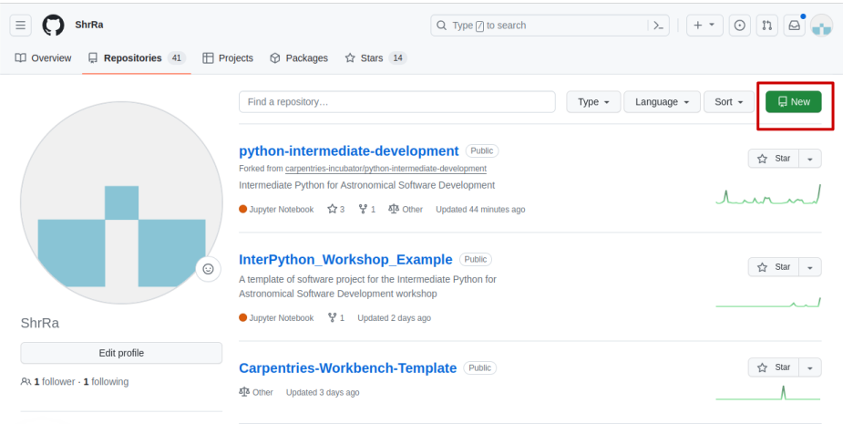
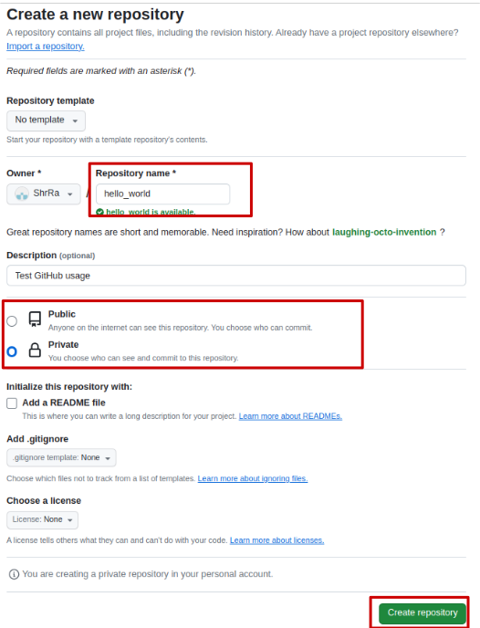
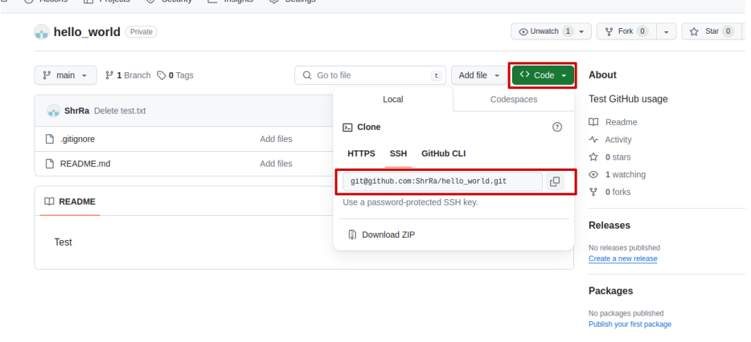

## Introduction
This short episode is dedicated to Git and GitHub - two popular tools for keeping 
track of the changes that happen in your code. A full explanation of Git and its features
would require a separate workshop (you can have a look at e.g. this 
[Carpentries Git Novices workshop](https://swcarpentry.github.io/git-novice/index.html)), however,
you will benefit even from using just few most popular features. In fact, in most cases
these features are all that you'll ever need!

**Git** is a free, collaborative, open-source version control system - a tool for recording the changes made to your
working files, and giving you an opportunity to recover any previous version of these files. 
Git does not upload all of the tracked files every time when you **make a commit** into a **repository** (or 'repo' for short); 
instead it records only 
the changed parts. This approach is computationally efficient and flexible, however, it requires some input from
your side. Git does not work as an auto-backup; in order to be useful, you have to explicitly state,
what are the changes that you want to save.

{: .image-with-shadow width="500px" }
Version control before Git. “notFinal.doc” by Jorge Cham, [https://www.phdcomics.com](https://www.phdcomics.com)

**GitHub** is a cloud-based hosting platform for storing Git repositories. Apart from storing the repositories,
it provides us with a number of additional functionalities:
- You can add collaborators to your repositories and manage their rights;
- You can let know the owners of other repositories about some bugs or ask for additional features ('Issues');
- You can propose your changes to the repositories of other people, and other people can propose changes to your projects ('Pull requests');
- You can edit your files right at the website;
- You can add automatic actions that will trigger at each commit, such as launching tests or build a website from your updates files;
- You can create private repository, that will be visible only for you;
- And many more.

Some of these features will be covered in the upcoming workshop. For now, let's concentrate on the basics.

### Installing Git on your PC

If you are using Windows or Linux OS, most likely, you already have Git available. 
You can check if it's true by running the following code in the terminal:
~~~
$ git --version
~~~
{: .language-bash}
You should get the version of your Git installation, something like this:
~~~
git version 2.18.4
~~~
{: .output}

If you are using Mac OS or seem to not have Git on Windows or Linux, 
[here](https://carpentries.github.io/workshop-template/install_instructions/#git)
you will find the instructions on how to fix this.

### Setting up a Github account
Setting up a GitHub account will take you some time, since you need not only 
register on the website, but also generate an SSH key on your PC, add it to GitHub
and set up an authentication method (which can be an app on your smartphone or text messages).
You can find the instructions on how to register on 
GitHub [here](https://swcarpentry.github.io/git-novice/index.html#creating-a-github-account).

### Connecting the Git on your PC with your GitHub account
Now you have the last step: you have to tell your Git installation what are your credentials
on GitHub. You have to do it only once, when you use Git for the first time on your machine.
To do this, in the terminal you have to configure the username and the email to which your GitHub
account is connected. 
~~~
$ git config --global user.name "Your Name"
$ git config --global user.email "name@example.com"
~~~
{: .language-bash}

By using `--global` you are telling Git to use these credentials for all repositories.

That's it! Now you can start using GitHub.

## Basic Git usage workflow

### Creating a repository
#### git init
Let's assume that you are starting a new software project called 'Hello_world' and you want to use
GitHub for keeping track of your work. In this case, you should start with creating a new directory
for this project:
~~~
$ cd location/of/your/project
$ mkdir hello_world
$ cd hello_world
~~~
{: .language-bash}

Now we are inside your project directory, and it's time to inform Git that its content
should be tracked. We do it by **creating a repository** with the following command:

~~~
$ git init
~~~
{: .language-bash}
~~~
Initialized empty Git repository in /home/alex/hello_world/.git/
~~~
{: .output}

Let's check if there is anything new in our project directory:

~~~
$ ls -a
~~~
{: .language-bash}

~~~
.  ..  .git
~~~
{: .output}

`ls -a` command tells your terminal to list all the directories and files in
the folder, including the hidden ones, and indeed, we have a new hidden directory `.git`. 
This directory contains everything needed for tracking the changes in your work folder.
Pay attention, that it is `.git` directory that is called `repository`, and therefore, it
is different from your 'working' or 'project' directory (which is in our case called 'hello_world').

> ## Can I make a repo out of already existing project?
> Sure you can! You can run `git init` in a folder with already existing files and proceed
> without any changes.
{: .callout}

#### .gitignore and README.md
Next step is to create two important files:
1. `.gitignore` - a text file that contains information about files that
   you don't want to track. Git will ignore these files in the future;
2. `README.md` - a markdown file that contains a description of your project.
   GitHub will show this information to those who visit the repository
   on your account page.

You can create these two files in any text editor. In the first file you 
can put specific file names, file extensions or whole directories that you 
don't want to track. For example, for a Python project you may want to add
'\_\_pycache\_\_', which is a service directory, and for a data science project
that creates some plots that you don't want to be tracked you will add '*.png' line. 
For now, put a `*.csv` in the file and 
save it in your `hello_world` directory under the name `.gitignore`. Then, in a new file
type any text and save it under the name `test.csv`.

Next, in a new file in the text editor write a description of your project, for example,
'This is a test project for GitHub'. Save this file under the name `README.md`.

Now you're ready to make your first commit!

#### First commit
Within a repository, each file can be in one of three states:
- **modified** (but **unstaged**): the files in your working directory are changed, but 
  you didn't put these changes into the repository;
- **staged**: you added the changed files in the **staging area** by using `git add name_of_the_file` command;
- and **committed**: you put the staged files in the repo by using `git commit -m "Commit message"`.

There are several technical reasons for separating staging area from the repository itself, but in general 
this separation makes Git system more flexible, allowing you to create finer and more specific commits.

Let's start with checking the current state of the repository: 
~~~
$ git status
~~~
{: .language-bash}

~~~
On branch main

No commits yet

Untracked files:
  (use "git add <file>..." to include in what will be committed)

	.gitignore
	README.md

nothing added to commit but untracked files present (use "git add" to track)
~~~
{: .output}

The output informs us about several things:
1. We are on git **branch** called `main`;
2. There no commits yet;
3. And we have two modified, but unstaged files: `.gitignore` and `README.md`.
   Pay attention, that `test.csv` does not appear on this list. Git ignores it,
   just as we specified in the `.gitignore`.

> ## Git branch? What's Git branch?
> In very simple terms, Git branch is an independent copy of the record of
> changes of your work. When you create and switch to a new branch, it creates an impression that
> you have an exact copy of your working directory. You can make whatever changes you like
> in this copy, and it won't affect the original branch (until you **merge** this new branch
> into an old one). This is a great tool for situations when you need to develop a new feature without being afraid to
> break something that already exists, or for collaborative work, when several people are introducing changes
> simultaneously. We will cover this topic in a more detail in the upcoming workshop.
{: .callout}

Now we can add our new files in the staging area by typing:
~~~
$ git add .gitignore README.md
~~~
{: .language-bash}
or, in case we are sure that we want to add all changes at once, just
~~~
$ git add --all
~~~
{: .language-bash}

If we type `git status` once again, we will see the following message:
~~~
On branch main

No commits yet

Changes to be committed:
  (use "git rm --cached <file>..." to unstage)

	new file:   .gitignore
	new file:   README.md
~~~
{: .output}

And now we can make the commit:
~~~
$ git commit -m "Create .gitignore and README.md"
~~~
{: .language-bash}
~~~
[main (root-commit) 610211e] Add files
 2 files changed, 2 insertions(+)
 create mode 100644 .gitignore
 create mode 100644 README.md
~~~
{: .output}

`git status` reveals that there is nothing to commit anymore. Our local repository now contains 
the relevant version of our files.

> ## The rules of a great commit message
> 1. Separate subject from body with a blank line
> 2. Limit the subject line to 50 characters
> 3. Do not end the subject line with a period
> 4. Capitalize the subject line and each paragraph
> 5. Use the imperative mood in the subject line
> 6. Wrap lines at 72 characters
> 7. Use the body to explain what and why vs. how
> 
> To add a commit message with both a subject and a body you can use
> the following command: `git commit -m "message subject" -m "message body"`.
{: .callout}

Now we can use `git push` command to send these changes into GitHub for safekeeping...
~~~
$ git push
~~~
{: .language-bash}
...and receive an error message:
~~~
fatal: No configured push destination.
Either specify the URL from the command-line or configure a remote repository using

    git remote add <name> <url>

and then push using the remote name

    git push <name>
~~~
{: .output}

That's because we need to create a remote repository for synchronizing it with our local repository.
Let's go to GitHub website and do this.

## Creating a remote repository
Open your account page on GitHub, go to `Repositories` tab and click on a green `New` button on the right side of the screen.
{: .image-with-shadow width="800px" }

In the opened window you need to specify the name of your repository, add a short description, choose if you want your repo to
be public or private and hit the `Create repository` button in the bottom.
{: .image-with-shadow width="500px" }

You may notice that there is an option to create a `.gitignore` and `README.md` files at this step too, 
as well as add a license for your project. Is it a good idea to do so? Absolutely! In fact, in most cases it is much more convenient than to
do it manually in your local repo, since you can choose one of the `.gitignore` templates (e.g. one for Python projects)
and edit the `README.md` using Markdown rendering right away. However, since our local copy of the repository already has these files,
we will opt out of it.

Finally, in the next screen GitHub offers us a list of options of how to connect this new remote repository
with a local one on our PC. Since we want to push an already existing repo, we are choosing option 2:

~~~
$ git remote add origin git@github.com:User_Name/hello_world.git
$ git branch -M main
$ git push -u origin main
~~~
{: .language-bash}

Depending on your security settings, you may need to enter your password, and then
a message similar to this will appear:
~~~
Enumerating objects: 6, done.
Counting objects: 100% (6/6), done.
Delta compression using up to 64 threads.
Compressing objects: 100% (4/4), done.
Writing objects: 100% (6/6), 445 bytes | 445.00 KiB/s, done.
Total 6 (delta 1), reused 0 (delta 0)
remote: Resolving deltas: 100% (1/1), done.
To github.com:User_Name/hello_world.git
 * [new branch]      main -> main
Branch 'main' set up to track remote branch 'main' from 'origin'.
~~~
{: .output}

Now we can make sure that all the changes are indeed pushed into the remote
repository. We can do this by 'pulling' information from the remote:

~~~
$ git pull
~~~
{: .language-bash}

~~~
Already up to date.
~~~
{: .output}
Getting a message `Already up to date.` means that your local and remote repositories are 
the same. Well done!

> ## Never forget to use 'git pull' before starting your work
> When there are several collaborators in your repo, it is possible that
> between your previous commit and the start of your work next day someone else already made changes
> in the repo. These situations rarely arise when the repo has clear and well-followed branch policies,
> but nevertheless, make a habit of executing `git pull` before starting your work,
> as it ensures that you are working on the up-to-date version of the code.
{: .callout}

## Cloning an already existing repo
In this last section, let's cover the subject of how you can create a local repository
out of already existing remote one. For this we'll delete our `hello_world` folder.
From the command line, you can do it by using this command:

~~~
$ rm -rf hello_world
~~~
{: .language-bash}

Now go to the page of your repository on GitHub and click on the green `Code` button.
In the drop-down widget you can copy the address of your repo.
{: .image-with-shadow width="800px" }

In the command line of your PC you can now run the `git clone` command:
~~~
$ git clone git@github.com:ShrRa/hello_world.git
~~~
{: .language-bash}
~~~
Cloning into 'hello_world'...
Enter passphrase for key '/home/alex/.ssh/id_ed25519': 
remote: Enumerating objects: 7, done.
remote: Counting objects: 100% (7/7), done.
remote: Compressing objects: 100% (4/4), done.
remote: Total 7 (delta 2), reused 5 (delta 1), pack-reused 0
Receiving objects: 100% (7/7), done.
Resolving deltas: 100% (2/2), done.
~~~
{: .output}

And you can start working in this local repository in the same way as before.

## The recap
Let's recall all the basic git commands and elements that we covered in this episode:
* `git init`: execute in your project directory; initializes the repository.
* `.gitignore`: a text file stating which kinds of files won't be tracked by Git.
* `README.md`: a Markdown file with project description and information.
* `git status`: shows the current state of your git repo.
* `git add file_name`: adds modified files into staging area.
* `git commit -m "Commit message"`: commit your staged changes into the repository.
* `git push`: pushes the changes into remote repo.
* `git pull`: pulls the latest changes from remote repo into the local one.
* `git clone`: clones a remote repository.

That's it! 

